# FPGA Fighter 🎮

> A Street Fighter-inspired 2-player fighting game built on the Nexys 7 FPGA platform using Verilog, VGA display, and state machine-based game logic.

<p align="center">
  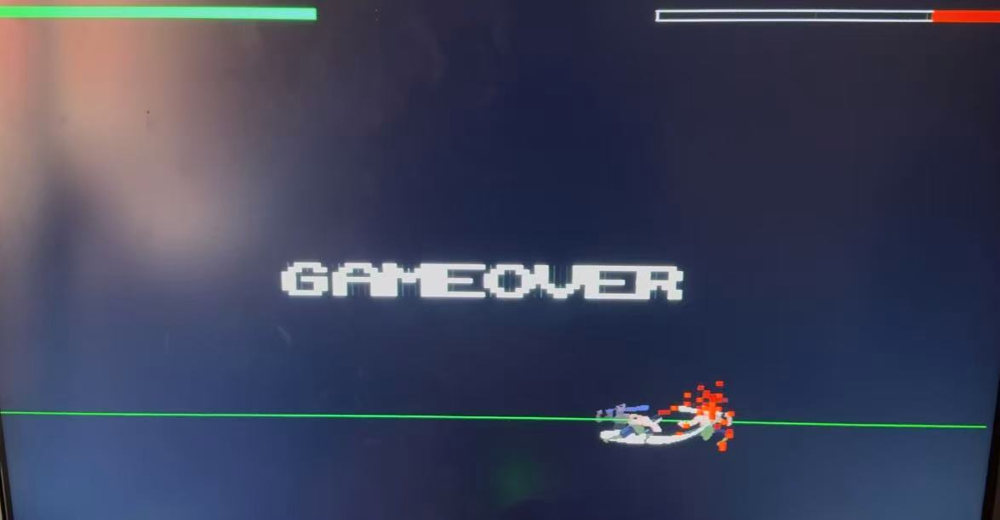
</p>

🔗 **Repository**: [github.com/Lou1e282/FPGA-Fighter-](https://github.com/Lou1e282/FPGA-Fighter-.git)

---

## Table of Contents

- [Overview](#overview)
- [Features](#features)
- [Architecture](#architecture)
- [Module Breakdown](#module-breakdown)
- [Implementation Details](#implementation-details)
- [Hardware Requirements](#hardware-requirements)
- [Build & Run](#build--run)
- [Testing & Verification](#testing--verification)
- [Challenges & Solutions](#challenges--solutions)
- [Future Work](#future-work)
- [Author](#author)

---

## Overview

This project implements a real-time 2-player fighting game on an FPGA, rendered through VGA output at 640×480 resolution. Players control characters that can move, jump, and attack, with sprite-based animations driven from BRAM. The game logic is entirely hardware-based, using hierarchical state machines and a centralized game resolver for hit detection and state arbitration.

## Features

- **2-Player Local Multiplayer** — Two players fight in real time with independent controls
- **Sprite Animation System** — Frame-by-frame character animations stored in BRAM (`.mem` format)
- **Hitbox / Hurtbox Combat** — Overlap-based hit detection with configurable attack windows
- **Gravity & Jump Physics** — Hardcoded parabolic jump trajectories with directional air control
- **HP Tracking & Game Over** — Health bars and win/lose conditions with on-screen display
- **External Controller Support** — Custom-built external controller for Player 2
- **VGA 640×480 Output** — Full-screen game rendering with background and UI elements

---

## Architecture

### System Architecture

The architecture separates input handling from game-state resolution. Each player collects their own input signals independently, but their final state is decided by combining those inputs with real-time conditions from the game resolver.

<p align="center">
  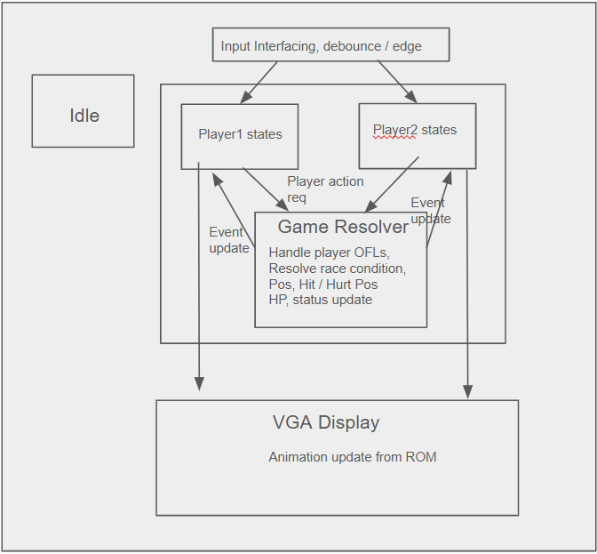
</p>

The system filters each player's requested actions through the state priority hierarchy. The game logic evaluates inputs and current conditions, determines and updates the correct states for each player, then drives the VGA display pipeline.

### Player State Machine

In a typical fighting game, state priority follows the hierarchy **HIT > ATTACK > MOVE > IDLE**, and this ordering controls both gameplay logic and animations.

<p align="center">
  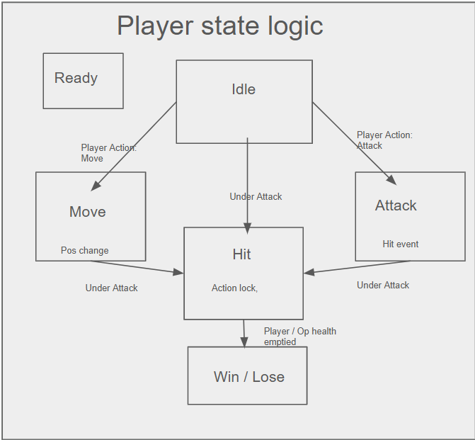
</p>

A player can either be **idle** (no inputs), **moving** (changing X/Y position based on controller input), **attacking** (dealing damage to a specific hitbox), or **taking hit** (hurtbox overlapped by opponent's hitbox). These states trigger the corresponding animations and game logic updates.

---

## Module Breakdown

<p align="center">
  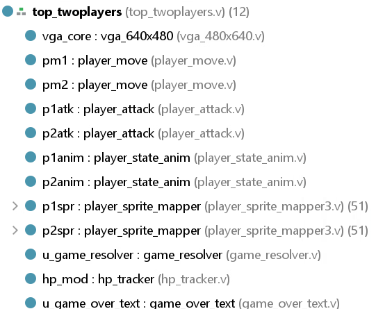
</p>

| Module | File | Description |
|---|---|---|
| **Top Design** | `top_twoplayers.v` | Top-level module wiring all submodules, VGA background, debug overlays |
| **Movement** | `player_move.v` | X-axis movement (left/right), jump physics with gravity, position clamping, spawn position |
| **Attack** | `player_attack.v` | Attack signal generation with `attack_active` / `attack_damage` split and pre-attack delay |
| **Game Resolver** | `game_resolver.v` | Hitbox-hurtbox overlap detection, hit event handling, state arbitration |
| **HP Tracker** | `hp_tracker.v` | Health point management per player |
| **VGA Driver** | `vga_640x480.v` | Standard 640×480 VGA timing and signal generation |
| **Sprite Mapper** | `player_sprite_mapper.v` | Maps ROM/BRAM data to sprite frames based on current state and animation frame index |
| **State Animation** | `player_state_anim.v` | Translates player state signals into animation frame sequences |
| **Game Over Text** | `game_over_text.v` | Renders win/lose text overlay |

---

## Implementation Details

### Movement & Jumping (`player_move.v`)

Maps X-position control with button left/right, and jumping with button up. Handling left-right movement and jumping in parallel allows directional jumping. X-position input is locked during each jump, and Y-position changes are hardcoded to mimic gravity for smooth, realistic arcs. Spawn positions after reset are customizable in the top design.

<p align="center">
  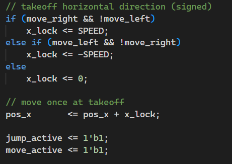
  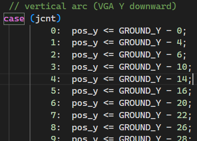
  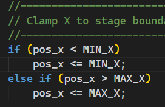
</p>
<p align="center">
  <em>X_lock during jumps &nbsp;&nbsp;&nbsp;&nbsp;&nbsp; Hardcoded jump trajectory &nbsp;&nbsp;&nbsp;&nbsp;&nbsp; Position clamp</em>
</p>

### Attack System (`player_attack.v`)

Maps attack action with `btn_down` and generates attack signals for each character. Each attack is handled with two signals:
- **`attack_active`** — triggers attack animations immediately
- **`attack_damage`** — delayed signal (4 + 10 + 4 frame window) that sends real damage to the game resolver

This creates a visible pre-attack windup before damage is applied.

<p align="center">
  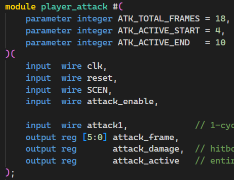
</p>

### Game Resolver (`game_resolver.v`)

Inside the game resolver module, hurtboxes and hitboxes are instantiated to send attack events when overlapped during combat. Hit events are handled through private variables inside the resolver to ensure stability.

### VGA Animation System

VGA animation relies on `player_sprite_mapper.v` and `player_state_anim.v`. The sprite mapper reads ROM files containing sprite frames and maps them to corresponding states, while the state animation module gathers state signals and triggers the correct frame sequences.

During implementation, we found that using just ROM to store animations resulted in very long synthesis times. The solution was to store sprite data in **BRAM** through `.mem` format files.

<p align="center">
  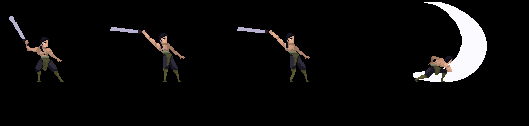
  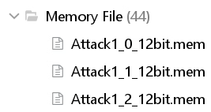
</p>
<p align="center">
  <em>Attack animation sprite frames &nbsp;&nbsp;&nbsp;&nbsp;&nbsp;&nbsp;&nbsp;&nbsp;&nbsp;&nbsp; .mem files (44 total)</em>
</p>

All sprites are exactly **126×126 pixels** with 12-bit color depth. The provided VGA 640×480 module serves as the video driver, with backgrounds and debug overlays (hitbox/hurtbox visualization) coded in the top design.

An external controller was also built for Player 2 inputs.

---

## Hardware Requirements

- **FPGA Board**: Nexys 7 (Xilinx Artix-7)
- **Display**: VGA monitor (640×480 @ 60Hz)
- **Input**: On-board buttons (Player 1) + custom external controller (Player 2)
- **Toolchain**: Xilinx Vivado

## Build & Run

1. Clone the repository:
   ```bash
   git clone https://github.com/Lou1e282/FPGA-Fighter-.git
   cd FPGA-Fighter-
   ```

2. Open the project in **Vivado** and add all `.v` source files and `.mem` memory files.

3. Set `top_twoplayers.v` as the top module.

4. Run **Synthesis → Implementation → Generate Bitstream**.

5. Program the Nexys 7 board and connect a VGA monitor.

6. Player 1 uses on-board buttons; Player 2 uses the external controller.

---

## Testing & Verification

Testing was done by individual modules, starting from completing action states of a single player, then scaling to the overall game logic and visual effects.

### 1. Button Input, Move / Attack Test — 11.14

Tested basic player block movement and attacking based on button input.

<p align="center">
  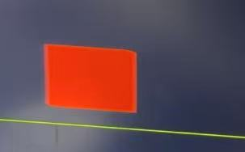
  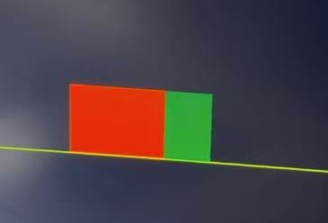
</p>
<p align="center">
  <em>← Jump test &nbsp;&nbsp;&nbsp;&nbsp;&nbsp;&nbsp;&nbsp;&nbsp; Attack test →</em>
</p>

### 2. Character Sprite Mapping Test — 11.20

Integrated character sprite mapper and animation generator to map sprite animation frames to player actions.

<p align="center">
  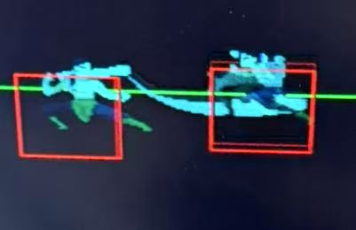
  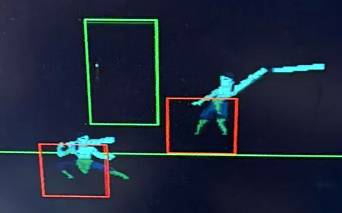
</p>
<p align="center">
  <em>← Sprite animation &nbsp;&nbsp;&nbsp;&nbsp;&nbsp;&nbsp;&nbsp;&nbsp; Hitbox visualization →</em>
</p>

### 3. Player State Resolver Response Test — 11.28

Full integration test with complete animations, hitstun, and game over conditions.

<p align="center">
  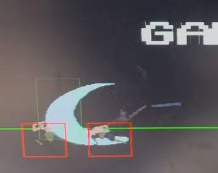
  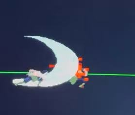
</p>
<p align="center">
  <em>← Complete animation &nbsp;&nbsp;&nbsp;&nbsp;&nbsp;&nbsp;&nbsp;&nbsp; Hitstun →</em>
</p>

### Verification Approach

- **Vivado Simulation**: Used for early debugging of synthesis errors, port mismatches, and state transition issues via waveform analysis
- **On-Board Testing**: Post-implementation verification on VGA monitor with LED indicators mapped to player states

---

## Challenges & Solutions

### BRAM Color Display Errors
Inconsistent sprite dimensions caused color rendering issues. **Fix**: Forced all ROM and `.mem` files to exactly **126×126 pixels**.

### Unresponsive Player Attacks
The attack logic was clocked with the wrong signal. **Fix**: Clocked attacks with the `pixclk` signal that correctly follows button input timing.

### Players Spawning at Wrong Position
Both players spawned at `min_x` instead of `spawn_x`. After investigation, the root cause was found in `player_move` — the reset signal was declared **synchronously**, causing `1'b0` to be fed to the character's X-position on reset, which then got clamped to `min_x`.

<p align="center">
  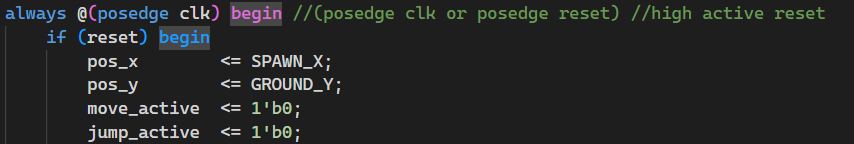
  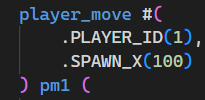
</p>
<p align="center">
  <em>Assign spawn_x to pos_x &nbsp;&nbsp;&nbsp;&nbsp;&nbsp;&nbsp;&nbsp;&nbsp; Customized instantiation</em>
</p>

**Fix**: Removed rising-edge reset detection and made the reset signal **asynchronous**, completely resolving the issue.

---

## Future Work

- More storage-efficient sprite animations to overcome BRAM limitations
- Multiple attack types and blocking mechanics
- Better input interfacing for richer player states
- Enhanced in-game visual effects (particles, UI polish)
- Stage obstacles and interactive props

---

## Author

**Louie Shen**

*Built for EE 354 — Final Project*
